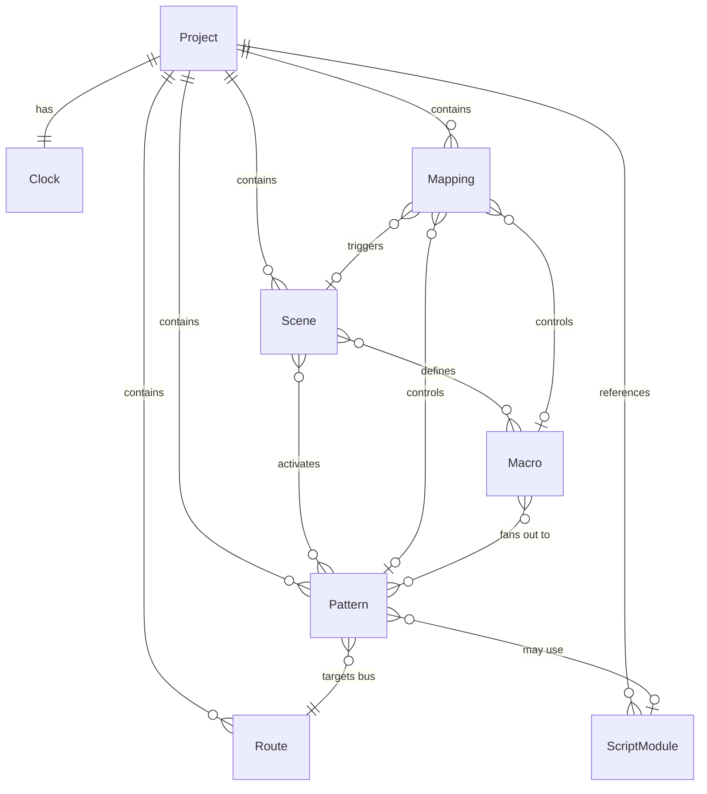

# Data Model: GenSeq MIDI Sequencer Engine

## Core Entities

### 1. Clock

**Purpose**: Master timing control for the entire system.

```typescript
interface Clock {
  // Configuration
  bpm: number;                    // 20-999, default 120
  ppq: number;                    // Pulses per quarter note (96, 192, 384, 480, 960)
  swing?: number;                 // 0-100%, default 0 (straight time)

  // Transport state (runtime, not persisted)
  playing: boolean;
  position: {
    bar: number;                  // Current bar (1-based)
    beat: number;                 // Current beat in bar (1-based)
    tick: number;                 // Current tick in beat (0-based)
  };
  startTime: bigint;              // process.hrtime.bigint() when started
}
```

**Validation Rules**:
- BPM must be between 20 and 999
- PPQ must be one of the standard values
- Swing must be 0-100

**State Transitions**:
- `stopped -> playing`: Start command
- `playing -> stopped`: Stop command
- Position updates every tick while playing

### 2. Pattern

**Purpose**: Defines algorithmic rules for generating MIDI events.

```typescript
interface Pattern {
  id: string;                     // Unique identifier
  name: string;                   // Display name
  type: 'euclidean' | 'probability' | 'phase' | 'script';
  enabled: boolean;               // Can be toggled on/off

  // Timing
  length: number;                 // Length in bars
  division: number;               // Note division (4 = quarter, 8 = eighth, etc.)

  // Target
  bus: string;                    // Logical bus name
  note?: number;                  // MIDI note number (0-127)
  channel?: number;               // MIDI channel (1-16)

  // Type-specific parameters
  parameters: {
    // Euclidean
    steps?: number;               // Total steps in pattern
    pulses?: number;              // Number of active pulses
    rotation?: number;            // Rotate pattern by N steps

    // Probability
    probability?: number;         // 0-100% chance per step
    density?: number;             // Overall density scaling

    // Phase
    phaseOffset?: number;         // Offset in ticks
    phaseRate?: number;           // Multiplication factor

    // Common
    velocity?: number | number[]; // Fixed or per-step velocities
    gateLength?: number;          // Note length in ticks
    humanize?: number;            // Timing variance in ms
  };

  // Script patterns only
  scriptPath?: string;            // Path to .js file
  scriptParams?: Record<string, any>; // Custom parameters for script
}
```

**Validation Rules**:
- ID must be unique within project
- Note must be 0-127 if specified
- Channel must be 1-16 if specified
- Bus must reference existing bus in routing
- Script path must exist and be valid JS

**State Transitions**:
- `disabled -> enabled`: Enable pattern
- `enabled -> disabled`: Disable pattern
- Parameters can be modified during playback (hot-reload)

### 3. Route

**Purpose**: Maps logical buses to physical MIDI devices and channels.

```typescript
interface Route {
  id: string;                     // Unique identifier
  bus: string;                    // Logical bus name
  device: string;                 // MIDI device name or index
  channel: number;                // MIDI channel (1-16)

  // Optional transformations
  transform?: {
    transpose?: number;           // Semitone offset
    velocityScale?: number;       // Velocity multiplier
    velocityOffset?: number;      // Velocity addition
    channelOverride?: number;     // Force different channel
  };
}
```

**Validation Rules**:
- Bus names must be unique
- Device must exist or be 'virtual'
- Channel must be 1-16

### 4. Scene

**Purpose**: Preset configuration of active patterns and their parameters.

```typescript
interface Scene {
  id: string;                     // Unique identifier
  name: string;                   // Display name

  // Pattern control
  activePatterns: string[];       // Pattern IDs to activate

  // Parameter overrides
  patternOverrides?: {
    [patternId: string]: {
      [param: string]: any;       // Override specific parameters
    };
  };

  // Macro values
  macros?: {
    [macroName: string]: number;  // 0.0-1.0 normalized
  };

  // Transition settings
  transition?: {
    type: 'immediate' | 'crossfade' | 'queued';
    duration?: number;            // Bars for crossfade
    quantize?: 'bar' | 'beat' | 'none';
  };
}
```

**Validation Rules**:
- Active patterns must reference existing pattern IDs
- Macro values must be 0.0-1.0
- Pattern overrides must match pattern parameter schema

**State Transitions**:
- Scene activation triggers pattern state changes
- Transition type determines timing of changes

### 5. Mapping

**Purpose**: Routes MIDI input to control parameters.

```typescript
interface Mapping {
  id: string;                     // Unique identifier
  name: string;                   // Display name
  enabled: boolean;               // Can be toggled

  // Input source
  input: {
    device: string;               // MIDI device name or 'any'
    channel?: number;             // MIDI channel (1-16) or any
    type: 'note' | 'cc' | 'pitchbend' | 'aftertouch';
    number?: number;              // Note or CC number
  };

  // Target
  target: {
    type: 'parameter' | 'macro' | 'scene' | 'transport';

    // For parameters
    patternId?: string;
    parameter?: string;

    // For macros
    macro?: string;

    // For scenes
    sceneId?: string;

    // For transport
    action?: 'play' | 'stop' | 'continue' | 'tap-tempo';
  };

  // Value transformation
  transform: {
    inputMin?: number;            // Input range start (default 0)
    inputMax?: number;            // Input range end (default 127)
    outputMin?: number;           // Output range start
    outputMax?: number;           // Output range end
    curve?: 'linear' | 'exponential' | 'logarithmic' | 'steps';
    steps?: number;               // For stepped curves
    smooth?: number;              // Smoothing time in ms
    deadzone?: number;            // Center deadzone size
  };

  // Behavior
  behavior?: {
    toggle?: boolean;             // Toggle on note-on/CC > 64
    latch?: boolean;              // Hold value until released
    quantize?: 'bar' | 'beat' | 'none'; // For scene changes
  };
}
```

**Validation Rules**:
- Device must exist or be 'any'
- Target must reference existing entity
- Transform ranges must be valid for target type

### 6. ScriptModule

**Purpose**: User-defined pattern generation logic.

```typescript
interface ScriptModule {
  path: string;                   // File path relative to project

  // Runtime contract (not persisted, validated at load)
  contract: {
    export: 'create';             // Required export function
    creates: {
      tick: (context: ScriptContext) => MidiEvent[];
    };
    maxExecutionTime: 5;          // ms
    maxMemory: 10;                // MB
  };
}

interface ScriptContext {
  params: Record<string, any>;    // Pattern parameters
  position: {
    bar: number;
    beat: number;
    tick: number;
  };
  ppq: number;
  helpers: {
    // Utility functions exposed to scripts
    euclidean: (steps: number, pulses: number) => boolean[];
    probability: (chance: number) => boolean;
    scale: (note: number, scale: string) => number;
  };
}

interface MidiEvent {
  tick: number;                   // When to fire (absolute tick)
  type: 'noteOn' | 'noteOff' | 'cc';
  note?: number;
  velocity?: number;
  controller?: number;
  value?: number;
}
```

**Validation Rules**:
- Must export 'create' function
- Must return tick function
- Execution must complete in 5ms
- Memory usage must stay under 10MB

### 7. Project

**Purpose**: Root configuration tying everything together.

```typescript
interface Project {
  version: string;                // Schema version for migration
  name: string;                   // Project name
  author?: string;                // Creator
  created: string;                // ISO date
  modified: string;               // ISO date

  // File references (paths relative to project root)
  files: {
    clock: string;                // clock.yaml
    patterns: string[];           // patterns/*.json
    routes: string[];             // routes/*.json
    scenes: string[];             // scenes/*.json
    mappings: string[];           // mappings/*.json
    scripts: string[];            // scripts/*.js
  };

  // Performance settings
  performance?: {
    maxPatterns?: number;         // Limit concurrent patterns
    maxCpuPercent?: number;       // CPU usage limit
    bufferSize?: number;          // MIDI buffer size
  };
}
```

## Relationships



## Configuration Files

### Directory Structure
```
project/
├── project.yaml              # Project metadata
├── clock.yaml                # Clock configuration
├── patterns/
│   ├── kick.json
│   ├── snare.json
│   └── hats.json
├── routes/
│   └── default.json          # Bus to device mappings
├── scenes/
│   ├── intro.json
│   ├── main.json
│   └── outro.json
├── mappings/
│   └── mpd218.json          # Controller mappings
└── scripts/
    └── custom-rhythm.js      # Custom pattern logic
```

### File Formats

All configuration files support both JSON and YAML formats. JSON is preferred for machine generation, YAML for human editing.

## Validation Strategy

1. **Schema Validation**: Every configuration file validated against JSON Schema
2. **Referential Integrity**: All references (pattern IDs, buses, etc.) verified
3. **Runtime Validation**: Script modules validated when loaded
4. **Hot-Reload Validation**: Changes validated before applying

## State Management

### Persistent State (Files)
- All configuration data
- Project structure
- User-defined patterns and mappings

### Runtime State (Memory)
- Transport position
- Active scene
- Current parameter values (after overrides/macros)
- MIDI device connections
- Performance metrics

### State Synchronization
- File changes trigger validation then state update
- State updates atomic at bar boundaries
- Failed updates roll back to last valid state