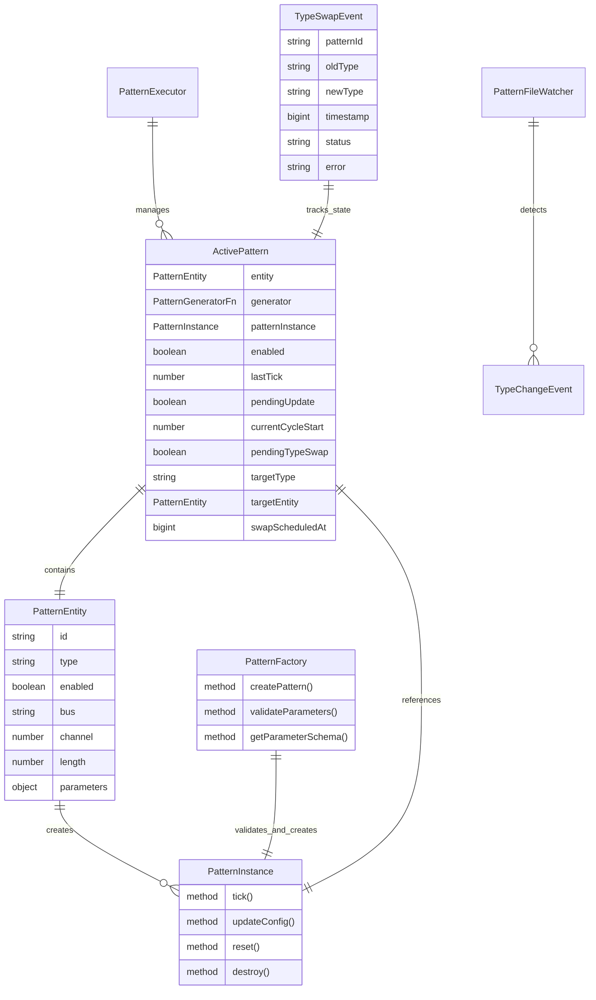
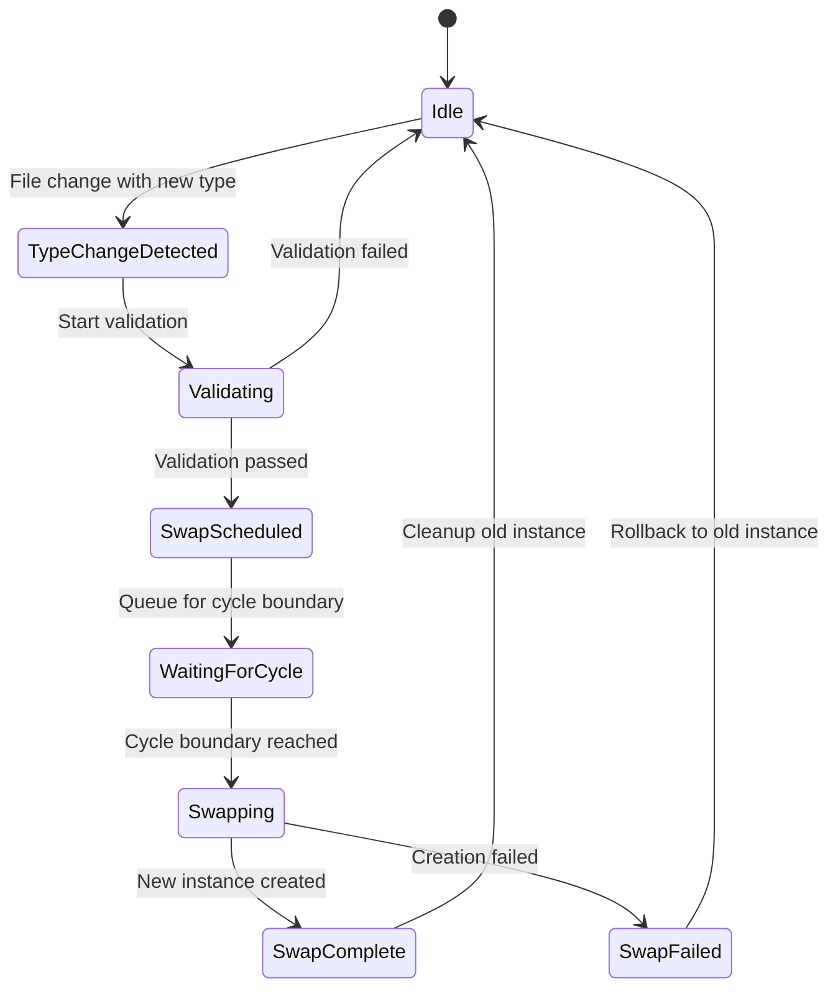
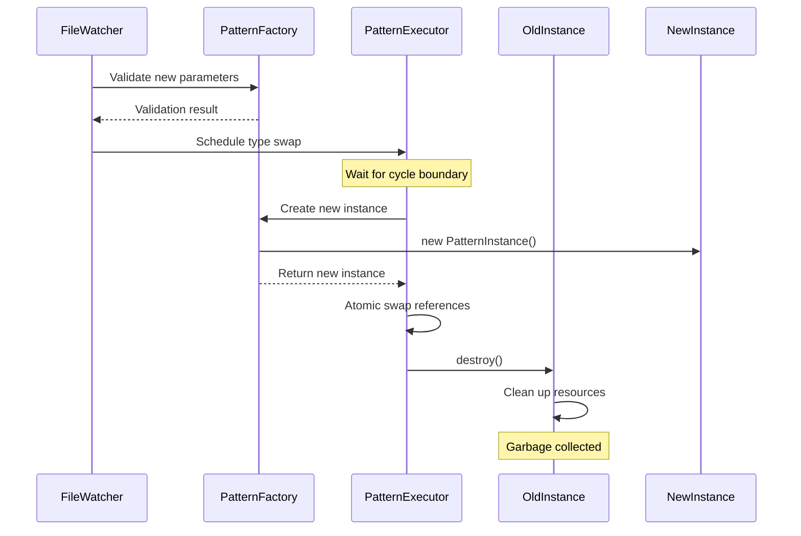

# Data Model: Pattern Type Hot-Reload

**Feature**: Pattern Type Hot-Reload
**Date**: 2025-11-23

## Entity Relationships



## Entity Definitions

### PatternEntity (Extended)

The existing PatternEntity from the base system, with emphasis on the `type` field:

```typescript
interface PatternEntity {
  id: string;                    // Unique identifier
  type: PatternType;              // 'euclidean' | 'probability' | 'phase' | 'script'
  enabled: boolean;               // Active/inactive state
  bus: string;                    // Output bus routing
  channel: number;                // MIDI channel (1-16)
  length: number;                 // Pattern length in bars
  parameters: Record<string, any>; // Type-specific parameters
}
```

**Validation Rules**:
- `type` must be one of: 'euclidean', 'probability', 'phase', 'script'
- `parameters` must match schema for specified type
- All fields required except `parameters` may be empty object

### ActivePattern (Extended)

Enhanced pattern execution state with type swap tracking:

```typescript
interface ActivePattern {
  // Existing fields
  entity: PatternEntity;
  generator: PatternGeneratorFn | null;
  patternInstance?: PatternInstance;
  enabled: boolean;
  lastTick: number;
  pendingUpdate: boolean;
  currentCycleStart?: number;

  // New type swap fields
  pendingTypeSwap: boolean;        // Flag indicating swap scheduled
  targetType: PatternType | null;  // Type to swap to
  targetEntity: PatternEntity | null; // Complete entity for swap
  swapScheduledAt: bigint | null;  // Timestamp when swap was scheduled
}
```

**State Invariants**:
- If `pendingTypeSwap` is true, `targetType` and `targetEntity` must be non-null
- `swapScheduledAt` is set when swap is scheduled, cleared after execution
- Only one type swap can be pending at a time

### PatternInstance

Common interface for all pattern type implementations:

```typescript
interface PatternInstance {
  // Generate MIDI events for current tick
  tick(context: PatternContext): MidiEvent[];

  // Update configuration (optional, for hot-reload)
  updateConfig?(config: Partial<any>): void;

  // Reset internal state (optional)
  reset?(): void;

  // Clean up resources (optional)
  destroy?(): void;
}
```

**Implementation Requirements**:
- All patterns MUST implement `tick()`
- Patterns SHOULD implement `updateConfig()` for parameter hot-reload
- Patterns MAY implement `reset()` and `destroy()` if needed

### PatternFactory

Centralized pattern creation and validation:

```typescript
interface PatternFactory {
  // Create pattern instance from entity
  createPattern(entity: PatternEntity): PatternInstance;

  // Validate type-specific parameters
  validateParameters(type: PatternType, params: Record<string, any>): ValidationResult;

  // Get JSON schema for pattern type
  getParameterSchema(type: PatternType): JSONSchema;
}

interface ValidationResult {
  valid: boolean;
  errors?: Array<{
    path: string;
    message: string;
  }>;
}
```

**Factory Responsibilities**:
- Validate parameters before instance creation
- Create appropriate pattern instance based on type
- Cache schemas for performance
- Provide consistent error messages

### TypeSwapEvent

Events emitted during type swap lifecycle:

```typescript
interface TypeSwapEvent {
  patternId: string;              // Pattern being swapped
  oldType: PatternType;           // Previous type
  newType: PatternType;           // Target type
  timestamp: bigint;              // High-resolution timestamp
  status: TypeSwapStatus;         // Current status
  error?: string;                 // Error message if failed
}

type TypeSwapStatus =
  | 'detected'    // Type change detected in file
  | 'scheduled'   // Swap scheduled for next cycle
  | 'complete'    // Swap successfully completed
  | 'failed';     // Swap failed, rolled back
```

**Event Flow**:
1. `detected` - Emitted when type field change detected
2. `scheduled` - Emitted when swap queued for cycle boundary
3. `complete` or `failed` - Final status after swap attempt

## State Transitions

### Type Swap State Machine



### State Transition Rules

**Idle → TypeChangeDetected**:
- Triggered by: File watcher detects `type` field change
- Actions: Store new entity, emit 'typeChangeDetected' event
- Guards: Pattern must exist, new type must be valid

**TypeChangeDetected → Validating**:
- Triggered by: Automatic after detection
- Actions: Validate parameters against new type schema
- Guards: None

**Validating → SwapScheduled**:
- Triggered by: Validation success
- Actions: Set pendingTypeSwap=true, store target entity
- Guards: Parameters must be valid for new type

**Validating → Idle**:
- Triggered by: Validation failure
- Actions: Emit error, clear pending state
- Guards: None

**SwapScheduled → WaitingForCycle**:
- Triggered by: Automatic after scheduling
- Actions: Wait for next cycle boundary
- Guards: None

**WaitingForCycle → Swapping**:
- Triggered by: Cycle boundary reached
- Actions: Create new instance, prepare swap
- Guards: pendingTypeSwap must be true

**Swapping → SwapComplete**:
- Triggered by: Successful instance creation
- Actions: Atomic swap, destroy old instance
- Guards: New instance must be valid

**Swapping → SwapFailed**:
- Triggered by: Instance creation error
- Actions: Rollback, keep old instance
- Guards: None

## Validation Rules

### Type-Specific Parameter Validation

**Euclidean Pattern**:
```yaml
required: [steps, pulses]
properties:
  steps:
    type: integer
    minimum: 1
    maximum: 64
  pulses:
    type: integer
    minimum: 0
    maximum: 64  # Must be <= steps
  rotation:
    type: integer
    default: 0
  note:
    type: integer
    minimum: 0
    maximum: 127
  velocity:
    oneOf:
      - type: integer
        minimum: 0
        maximum: 127
      - type: array
        items:
          type: integer
          minimum: 0
          maximum: 127
  duration:
    type: number
    minimum: 0.001
    maximum: 16
```

**Probability Pattern**:
```yaml
required: [probability, density]
properties:
  probability:
    type: number
    minimum: 0
    maximum: 1
  density:
    type: number
    minimum: 0.25
    maximum: 16
  seed:
    type: integer
    minimum: 0
  note:
    type: integer
    minimum: 0
    maximum: 127
  velocity:
    oneOf:
      - type: integer
        minimum: 0
        maximum: 127
      - type: array
  duration:
    type: number
    minimum: 0.001
    maximum: 16
```

**Phase Pattern**:
```yaml
required: [phase1, phase2]
properties:
  phase1:
    type: number
    minimum: 0.25
    maximum: 32
  phase2:
    type: number
    minimum: 0.25
    maximum: 32
  offset:
    type: number
    default: 0
  note:
    type: integer
    minimum: 0
    maximum: 127
  velocity:
    oneOf:
      - type: integer
      - type: array
  duration:
    type: number
    minimum: 0.001
    maximum: 16
```

**Script Pattern**:
```yaml
required: [scriptPath]
properties:
  scriptPath:
    type: string
    pattern: '^[a-zA-Z0-9-_./]+\.js$'
  params:
    type: object
  note:
    type: integer
    minimum: 0
    maximum: 127
  velocity:
    type: integer
    minimum: 0
    maximum: 127
  duration:
    type: number
    minimum: 0.001
    maximum: 16
```

### Cross-Type Validation Rules

1. **Type Transition Matrix**: All 12 type transitions must be supported
2. **Parameter Isolation**: Parameters from old type must not affect new type
3. **Entity Consistency**: id, bus, channel, enabled must remain valid
4. **Cycle Timing**: Swaps only occur at cycle boundaries

## Memory Management

### Instance Lifecycle



### Resource Management Rules

1. **Creation**: New instances created only after validation
2. **Swap**: References swapped atomically at cycle boundary
3. **Cleanup**: Old instance destroy() called immediately after swap
4. **Failure**: Old instance retained on swap failure
5. **Memory**: No references kept to destroyed instances

## Performance Constraints

### Timing Requirements

| Operation | Maximum Duration | Measurement Point |
|-----------|-----------------|-------------------|
| Type change detection | 5ms | File change to detection |
| Parameter validation | 10ms | Start to completion |
| Instance creation | 20ms | Constructor to ready |
| Reference swap | 1ms | Atomic operation |
| Old instance cleanup | 5ms | destroy() call |
| **Total type swap** | **50ms** | **Detection to complete** |

### Memory Constraints

| Resource | Limit | Notes |
|----------|-------|-------|
| Pattern instance size | <1MB | Including internal state |
| Pending swaps | 10 max | Queue overflow protection |
| Schema cache | <10MB | All pattern type schemas |
| Event queue | 100 events | Circular buffer |

## Error Handling

### Error Categories

**Validation Errors**:
- Invalid type value
- Missing required parameters
- Parameter type mismatches
- Parameter range violations

**Creation Errors**:
- Pattern class not found
- Constructor exceptions
- Resource allocation failures
- Script loading errors (script type)

**Swap Errors**:
- Cycle boundary timeout
- Memory allocation failure
- State corruption detected

### Error Recovery

1. **Validation Failure**: Reject change, log error, continue with old pattern
2. **Creation Failure**: Rollback swap, retain old instance, emit failure event
3. **Swap Failure**: Abort swap, restore previous state, log detailed error
4. **Catastrophic Failure**: Disable pattern, continue engine operation

## Concurrency Considerations

### Race Condition Prevention

1. **Single Swap Queue**: Only one type swap pending per pattern
2. **Atomic Flags**: Use atomic boolean updates for state changes
3. **Cycle Synchronization**: All swaps occur at cycle boundaries
4. **Event Ordering**: Events emitted in deterministic order

### Thread Safety

- Node.js single-threaded event loop ensures no true parallelism
- Async operations (file I/O) handled via event queue
- Pattern instances are not shared between contexts
- State mutations occur synchronously within tick handler